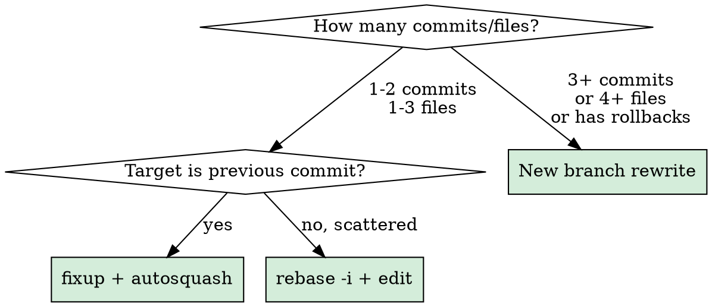
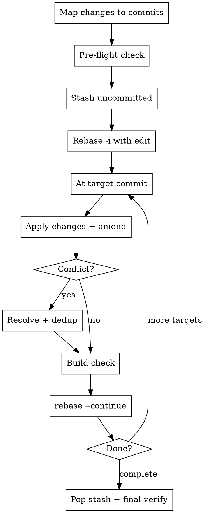

# Absorb Changes into Existing Commits

## Overview

Absorb pending changes into the logically correct earlier commits via interactive rebase. Eliminates fix/rollback commit clutter by putting changes where they belong from the start.

## Strategy Selection



| Scenario | Strategy |
|----------|----------|
| Single fix targeting the previous commit | `git commit --fixup <hash>` + `git rebase --autosquash -i <base>` |
| 1-3 files across 1-2 target commits | `rebase -i` + `edit` + `amend` (core pattern below) |
| Many files, many commits, includes rollbacks | Clean rewrite on a new branch (see "New Branch Strategy") |

## When to Use

- Uncommitted changes that belong in an earlier commit (not HEAD)
- Fix commits that should be folded into the commit they fix
- Code review feedback that should appear as if it was always there
- Post-refactor cleanup scattered across multiple earlier commits

## When NOT to Use

- Changes belong in HEAD — just `git commit --amend`
- Already pushed to shared branch — discuss with team first

## Pre-flight Checklist

Before starting ANY absorb operation:

```bash
# 1. Check for stash contamination — other work's stash can pollute working tree
git stash list
# If stashes exist, inspect contents before proceeding

# 2. Check working tree state
git status

# 3. Check for linter/formatter auto-changes — IDE auto-saves (import reordering,
#    trailing commas) create unintended diffs. Commit or revert them first.
```

## Core Pattern: rebase -i + edit



### Step 1: Map changes to target commits

```
Change A (file1.kt line 42) -> commit abc123 "feat: add feature X"
Change B (file2.kt new method) -> commit def456 "refactor: simplify Y"
Change C (file3.kt fix) -> commit abc123 "feat: add feature X"  (same target)
```

### Step 2: Stash and rebase

```bash
git stash  # if uncommitted changes exist

# Mark target commits as 'edit'
# NOTE: sed -i '' is macOS only. On Linux use sed -i (no quotes).
GIT_SEQUENCE_EDITOR="sed -i '' \
  -e 's/^pick abc123/edit abc123/' \
  -e 's/^pick def456/edit def456/'" \
  git rebase -i <base-commit>
```

### Step 3: At each stopped commit

```bash
# Option A: Pop stash and stage selectively
git stash pop
git add file1.kt file3.kt  # Only files for THIS commit
git stash                    # Re-stash the rest
git commit --amend --no-edit

# Option B: Apply from a reference branch (safer for complex changes)
git show <source-branch>:path/to/file > path/to/file
git add path/to/file
git commit --amend --no-edit
```

### Step 4: Handle conflicts

```bash
# Edit conflict markers — usually keep BOTH sides:
# <<<< HEAD = amend content (what you're adding)
# ==== >>>> = subsequent commit changes (must preserve)
#
# WATCH FOR: duplicate declarations after stash pop
#   (e.g., variable declared twice, method called twice)
#   -> Manually dedup before amending
git add <conflicted-file>
git rebase --continue
```

### Step 5: Build verify at each significant stop

```bash
# Don't wait until the end — verify at each edit stop.
# Catching a bad conflict resolution early saves a full redo.
./gradlew compileDebugKotlin  # or your build command
```

### Step 6: Final verify

```bash
git stash pop  # if anything left
git log --oneline <base>..HEAD  # verify clean history
```

## New Branch Strategy (Large-Scale Absorb)

When changes span 3+ commits or the history includes rollback/fix commits:

1. **Record the final state** — note the current HEAD commit hash as the source of truth
2. **Create a clean branch from base**: `git checkout <base> -b <branch>-clean`
3. **Rewrite commits by logical unit**:
   - Reference final file state via `git show <source-hash>:<file>`
   - Apply only the changes belonging to the current commit
   - **Self code review**: check `git diff --cached` before committing
   - **Build check**: build before every commit
   - Commit
4. **Final diff comparison**: `git diff <original-branch> -- '*.kt' '*.xml'`
   - If differences exist, verify they are intentional improvements

## Common Mistakes

| Mistake | Fix |
|---------|-----|
| Stash contamination (popping another work's stash) | Check `git stash list` before starting. Drop unrelated stashes. |
| Duplicate declarations after stash pop | Always check diff before amend — manually dedup |
| Applying ALL changes at the first stop | Only apply changes belonging to THAT commit |
| Picking one side in conflict resolution | Usually need both — amend content + subsequent changes |
| Build check only at the end | Check at each edit stop — late discovery means full redo |
| `sed -i ''` fails on Linux | macOS: `sed -i ''`, Linux: `sed -i` |
| Linter auto-changes cause conflicts | Commit or revert linter changes before starting rebase |

## Alternative: GIT_EDITOR for Bulk Message Rewording

When absorbing only commit message changes (no code):

```bash
cat > /tmp/reword.sh << 'SCRIPT'
#!/bin/bash
FILE="$1"
CURRENT=$(head -1 "$FILE")
case "$CURRENT" in
*"keyword"*) cat > "$FILE" << 'EOF'
new commit message here

- bullet point body
EOF
;;
esac
SCRIPT
chmod +x /tmp/reword.sh

GIT_SEQUENCE_EDITOR="sed -i '' 's/^pick /reword /g'" \
  GIT_EDITOR="/tmp/reword.sh" \
  git rebase -i <base>
```
